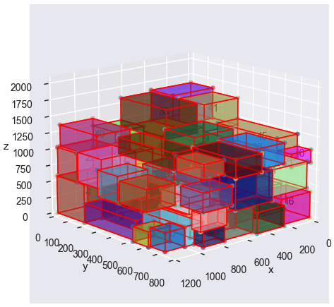
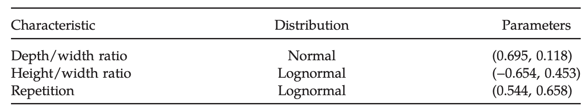
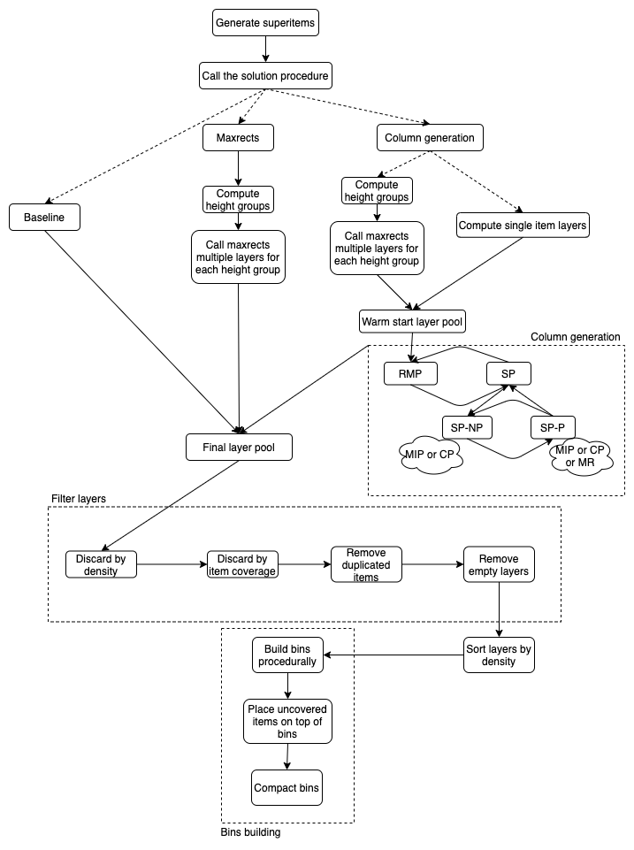
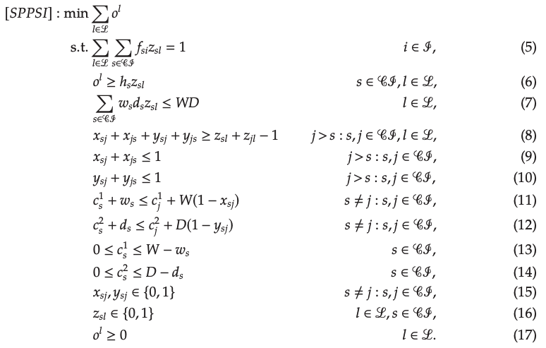
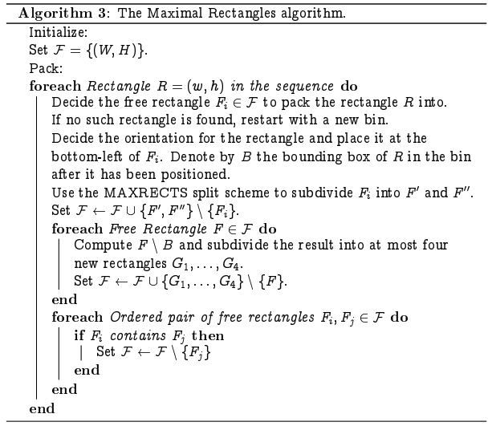
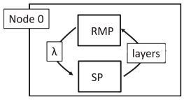
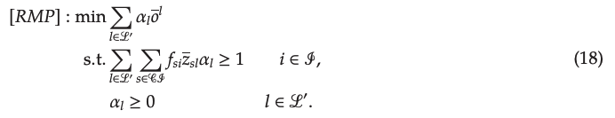
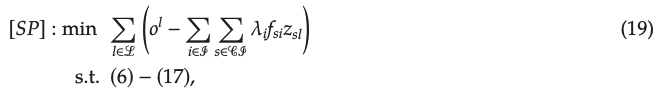

# 3D Bin Packing

<style>
img
{
    display:block;
    float:none;
    margin-left:auto;
    margin-right:auto;
    width:auto;
}
</style>



This repository contains different implementations of heuristics-based and mathematical programming approaches to solve the 3D bin packing problem (3D-BPP):

1. Baseline MP model [[1]](#1-samir-elhedhli-fatma-gzara-and-burak-yildiz-2019)
2. Maxrects generalized to 3D (2D implementation based on [rectpack](https://github.com/secnot/rectpack)) [[3]](#3-jukka-jylänki-2010)
3. Column generation MP model [[1]](#1-samir-elhedhli-fatma-gzara-and-burak-yildiz-2019)

All solutions are based on the concept of layers, which are collections of items having similar heights (within a pre-specified tolerance) that are thus having the same base z-coordinate. Using layers we are able to relax the 3D problem to a set of 2D ones, boosting efficiency-related metrics. Moreover, the usage of superitems (i.e. compounding similar items together in a bigger item) enables us to both lower the amount of items we are effectively dealing with and also to maximize layer density, thanks to the compact stacking of items in a superitem.

The bins building procedure is always handled in a procedural way, stacking layers on top of each other until a bin is full and opening new bins as needed. Before layers are placed in a bin, they are filtered based on a set of criteria (as described in [[1]](#1-samir-elhedhli-fatma-gzara-and-burak-yildiz-2019)), such as item coverage and layer density. After layers are placed in a bin, some items could still be "flying" (i.e. have zero support at their base): to solve this issue, we let items "fall" to the ground as much as possible, without allowing intersections, thus ensuring compactness and correctness.

## Dataset

The dataset in use is based on the benchmark dataset introduced in [[1]](#1-samir-elhedhli-fatma-gzara-and-burak-yildiz-2019). As the original code is not publicly available, we made our best effort to reproduce the dataset as closely as possible. A pre-computed dataset with 1M examples is available in the `data/` folder (`products.pkl`).



## Solutions



Below you can find a broad explanation of each implemented solution. Every procedure can be called through the same function (`main()` in module `main.py`), by changing the `procedure` parameter (it could be `bl` for baseline, `mr` for maxrects or `cg` for the column generation approach). Down below you can find a MWE on how to use the library:

```python
from src import config, dataset, main

# Load dataset
product_dataset = dataset.ProductDataset(
    "data/products.pkl",
    config.NUM_PRODUCTS,
    config.MIN_PRODUCT_WIDTH,
    config.MAX_PRODUCT_WIDTH,
    config.MIN_PRODUCT_DEPTH,
    config.MAX_PRODUCT_DEPTH,
    config.MIN_PRODUCT_HEIGHT,
    config.MAX_PRODUCT_HEIGHT,
    config.MIN_PRODUCT_WEIGHT,
    config.MAX_PRODUCT_WEIGHT,
    force_overload=False,
)

# Get random order
order = product_dataset.get_order(50)

# Solve bin packing using the specified procedure to get
# a pool of bins without "flying" products
bin_pool = main.main(
    order,
    procedure="bl",
)

# Plot the bin pool
bin_pool.plot()
```

### Baseline

The baseline model directly assigns superitems to layers and positions them by taking into account overlapment and layer height minimization. It reproduces model [SPPSI] of [[1]](#1-samir-elhedhli-fatma-gzara-and-burak-yildiz-2019). Beware that it might be very slow and we advice using it only for orders under 30 items.



### Maxrects

Maxrects [[3]](#3-jukka-jylänki-2010) is an heuristic algorithm that was built to solve the 2D bin packing problem. In our solution, maxrects is generalized to 3D thanks to the use of layers and height groups. In particular, items are grouped together based on their 3rd dimension (the height) and a specified tolerance. Such groups of items are then used as inputs for a custom maxrects procedure in which layers are thought of as bins. The maxrects algorithm itself is implemented in the [rectpack](https://github.com/secnot/rectpack) library.



### Column generation

The column generation solution aims to decompose the [SPPSI] approach in 2 components: the main and the pricing sub-problems. Column generation acts by iteratively solving both sub-problems ([RMP] and then [SP]) and incorporates more and more variables along the way. In this way, the main problem [RMP] selects the best layers so far and provides dual variables (one for each item) to be used in the pricing sub-problem [SP], which determines the best subset of items to compose a new layer, that will be carried forward (in the next iteration) iff its reduced cost is non-negative (otherwise column generation terminates). Moreover, column generation is given a set of columns as warm start and such layers are computed by either the maxrects procedure or by adding one layer for each item (each layer having only one item).





Authors in [[1]](#1-samir-elhedhli-fatma-gzara-and-burak-yildiz-2019) further decompose the pricing sub-problem [SP] in two components: the no-placement and placement strategies. The former [SP-NP] serves as an item selection mechanism, thus ignoring the expensive placement constraints. The algorithm then checks whether there is a feasible placement of the selected items in a layer [SP-P]: if such a feasible placement exists, the column is added to the master problem, otherwise a new call to [SP-NP] is necessary, with an additional feasibility constraint (on the maximum number of selectable items). The no-placement/placement procedure continues until a feasible placement is found. In our implementation, we used a MIP solution for [SP-NP] (the `sp_np_type` parameter of the `main.main` function also allows to select a CP-based approach) and maxrects for [SP-P] (the `sp_p_type` parameter of the `main.main` function also allows to select exact MIP-based or CP-based approaches).

Differing from the author's description, our implementation does not incorporate column generation in a branch-and-price scheme.

## Utilities

### Lower bounds

Martello, Pisinger and Vigo [[2]](#2-silvano-martello-david-pisinger-and-daniele-vigo-1998) provided 3 different formulations to compute lower bounds on the number of required bins to pack the set of items we have at our disposal. In their paper, they present the following bounds:

1. **L0** (or continuous lower bound): comes from a relaxation in which each item's occupied space is associated with its liquid volume, thus ignoring the actual item placements and other constraints (it is shown to have a worst-case performance ratio of 1 / 8)
2. **L1**: better suited for instances with a large number of items and still computable in linear time (its worst-case performance can be arbitrarily bad)
3. **L2**: better suited for instances with a large number of items, but requires quadratic time to be computed (it is shown to have a worst-case performance ratio of 2 / 3)

To compute such lower bounds, you can rely on functions implemented in the `utils` module: `get_l0_lb`, `get_l1_lb` and `get_l2_lb` for L0, L1 and L2, respectively. All functions have the same interface: they require an `order` and a `pallet_dims` attribute. The former should be taken from the `ProductDataset` class using the `get_order` function, while the latter should be an instance of the `Dimension` class (available in the `utils` module). L0 returns a single value, while L1 and L2 return 4 values, with the first one being the actual lower bound and the other 3 values being lower bounds on 2 dimensions (as described in [2](#2-silvano-martello-david-pisinger-and-daniele-vigo-1998)).

## Development environment

To work on `3d-bpp` library a suitable Python environment is needed, is possible to use [conda](https://github.com/conda/conda) to manage such environment.

The following commands will create a Python virtual environment called `3d-bpp` and install all the required dependencies to use and develop on the project.

```bash
conda env create -f environment.yml
conda activate 3d-bpp
pre-commit install # For pre-commit checks
```

to update the `3d-bpp` environment in case its already present run `conda env update`

Alternatively one can manage such virtual environment using Python itself.

```bash
python -m venv venv # Create a virtual environment in the folder venv
source venv/bin/activate
pip install -e .[dev]
pre-commit install # For pre-commit checks
```

The `-e` flag creates a link to the current folder in the `site-package` folder, such that the library can be modified reflecting directly the changes in the environment where the library was installed.

## Installation

To simply install and use the library from the package index run

```bash
pip install 3d-bpp
```

or to install from the local folder

```bash
pip install .
```

## Execution

The library can be used from another project, by importing the necessary sources from `3d-bpp/` or it can be used as a standalone bin packing library, by leveraging the interface functions in `3d-bpp/main.py`.

If you want to see a working example, please check out the `bpp.ipynb` Jupyter notebook, that contains an explanation of the dataset in use, along with a comparison of all the implemented solutions.

For a more entertaining and interactive solution, you can also run the implemented [Streamlit](https://streamlit.io/) dashboard, by simply running the following command from the root of the project:

```bash
python3 -m streamlit run src/dashboard.py
```

## Slides

To start the slide show:

1. Change directory to `slides/`
1. Run `npm install` and `npm run dev`
1. Visit [http://localhost:3030](http://localhost:3030)

Edit the [slides.md](./slides/slides.md) to see the changes.

Learn more about Slidev on [documentations](https://sli.dev/).

## References

### 1 _Samir Elhedhli, Fatma Gzara and Burak Yildiz (2019)_,\

**Three-Dimensional Bin Packing and Mixed-Case Palletization**,\
INFORMS Journal on Optimization.

### 2 _Silvano Martello, David Pisinger and Daniele Vigo (1998)_,\

**The Three-Dimensional Bin Packing Problem**,\
Operations Research.

### 3 _Jukka Jylänki (2010)_.\

**A Thousand Ways to Pack the Bin - A Practical Approach to Two-Dimensional Rectangle Bin Packing**.\
-.
